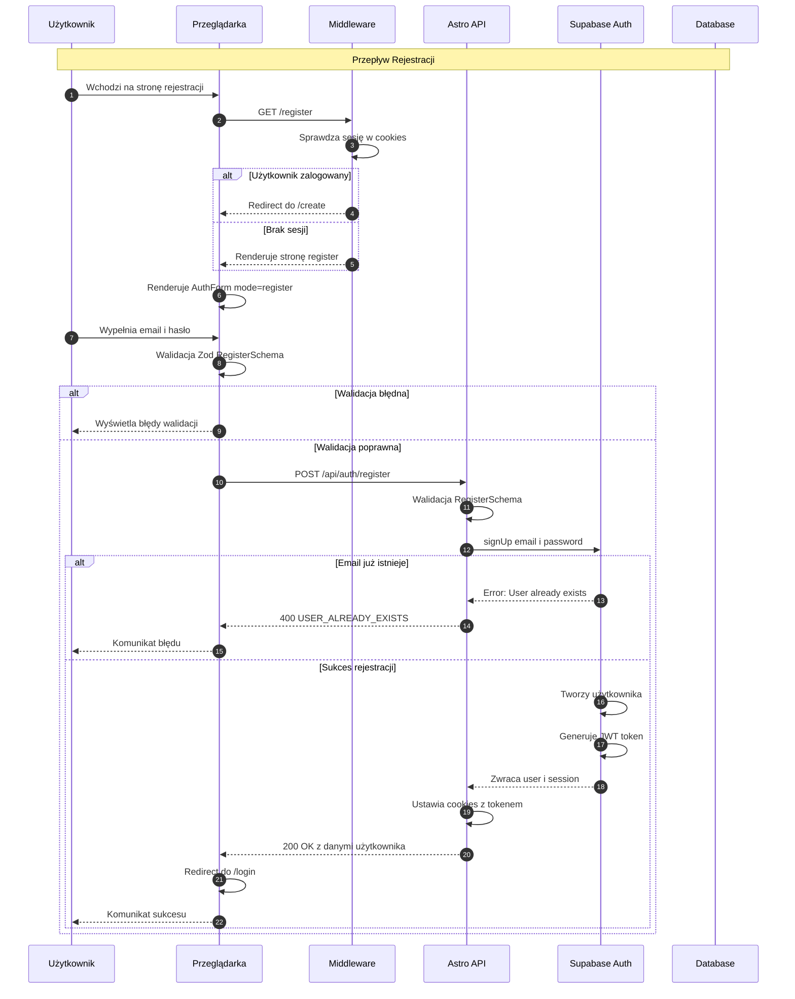
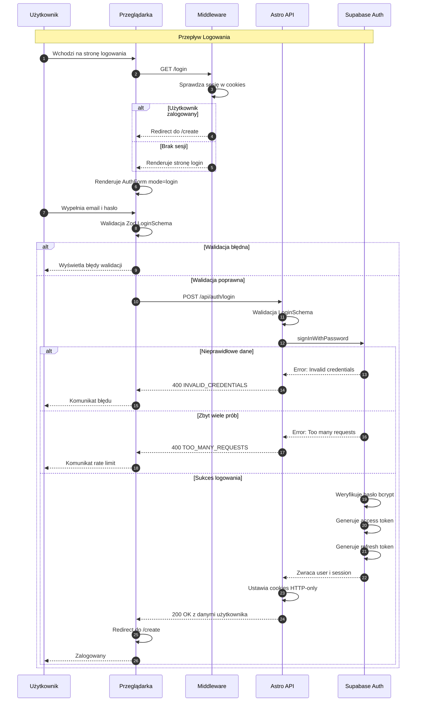
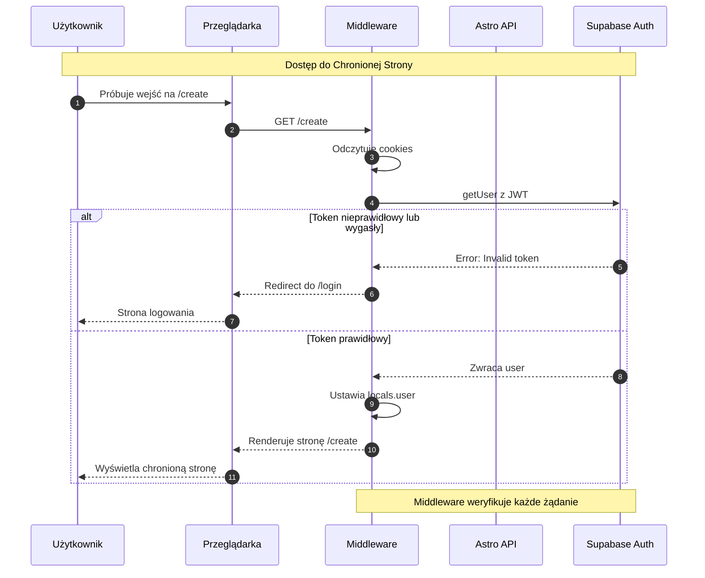
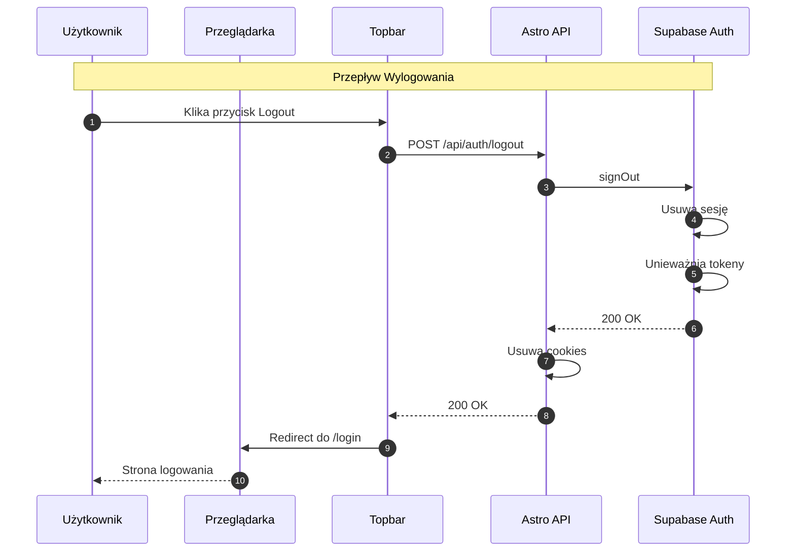
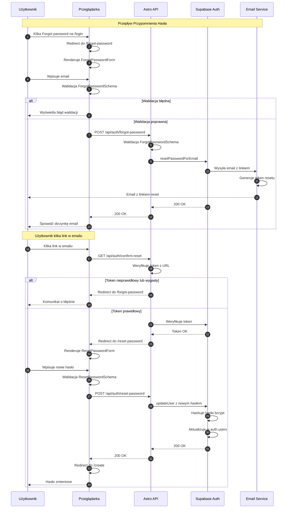
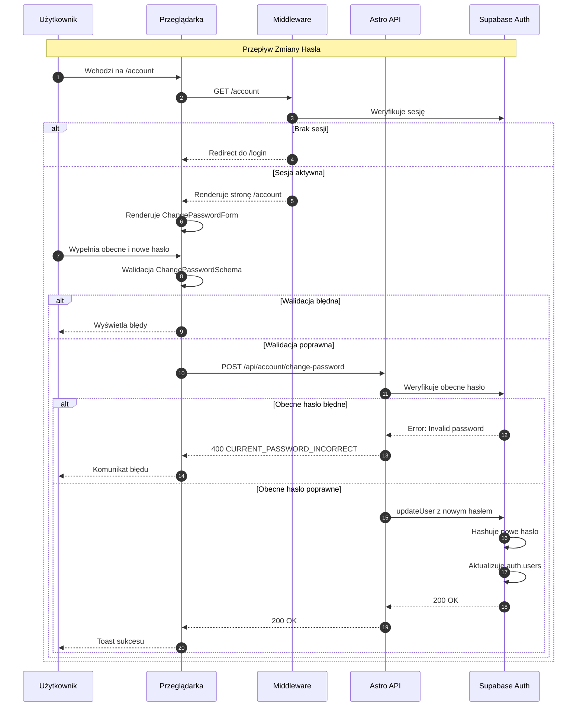
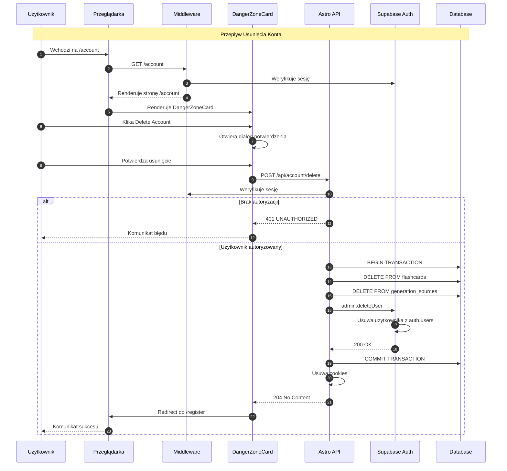
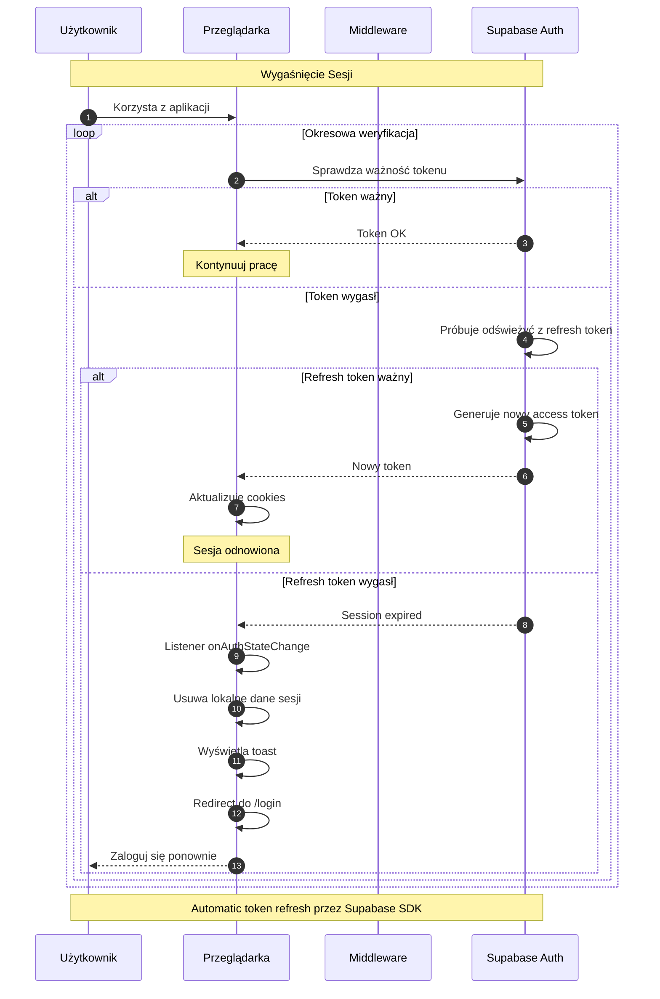

# Diagramy Sekwencji Autentykacji - 10x Cards

```mermaid
sequenceDiagram
    autonumber
    participant U as Użytkownik
    participant B as Przeglądarka
    participant M as Middleware
    participant API as Astro API
    participant SA as Supabase Auth
    participant DB as Database
    
    Note over U,DB: Przepływ Rejestracji
    
    U->>B: Wchodzi na stronę rejestracji
    B->>M: GET /register
    M->>M: Sprawdza sesję w cookies
    alt Użytkownik zalogowany
        M-->>B: Redirect do /create
    else Brak sesji
        M-->>B: Renderuje stronę register
    end
    
    B->>B: Renderuje AuthForm mode=register
    U->>B: Wypełnia email i hasło
    B->>B: Walidacja Zod RegisterSchema
    
    alt Walidacja błędna
        B-->>U: Wyświetla błędy walidacji
    else Walidacja poprawna
        B->>API: POST /api/auth/register
        API->>API: Walidacja RegisterSchema
        API->>SA: signUp email i password
        
        alt Email już istnieje
            SA-->>API: Error: User already exists
            API-->>B: 400 USER_ALREADY_EXISTS
            B-->>U: Komunikat błędu
        else Sukces rejestracji
            SA->>SA: Tworzy użytkownika
            SA->>SA: Generuje JWT token
            SA-->>API: Zwraca user i session
            API->>API: Ustawia cookies z tokenem
            API-->>B: 200 OK z danymi użytkownika
            B->>B: Redirect do /login
            B-->>U: Komunikat sukcesu
        end
    end
```

```mermaid
sequenceDiagram
    autonumber
    participant U as Użytkownik
    participant B as Przeglądarka
    participant M as Middleware
    participant API as Astro API
    participant SA as Supabase Auth
    
    Note over U,SA: Przepływ Logowania
    
    U->>B: Wchodzi na stronę logowania
    B->>M: GET /login
    M->>M: Sprawdza sesję w cookies
    alt Użytkownik zalogowany
        M-->>B: Redirect do /create
    else Brak sesji
        M-->>B: Renderuje stronę login
    end
    
    B->>B: Renderuje AuthForm mode=login
    U->>B: Wypełnia email i hasło
    B->>B: Walidacja Zod LoginSchema
    
    alt Walidacja błędna
        B-->>U: Wyświetla błędy walidacji
    else Walidacja poprawna
        B->>API: POST /api/auth/login
        API->>API: Walidacja LoginSchema
        API->>SA: signInWithPassword
        
        alt Nieprawidłowe dane
            SA-->>API: Error: Invalid credentials
            API-->>B: 400 INVALID_CREDENTIALS
            B-->>U: Komunikat błędu
        else Zbyt wiele prób
            SA-->>API: Error: Too many requests
            API-->>B: 400 TOO_MANY_REQUESTS
            B-->>U: Komunikat rate limit
        else Sukces logowania
            SA->>SA: Weryfikuje hasło bcrypt
            SA->>SA: Generuje access token
            SA->>SA: Generuje refresh token
            SA-->>API: Zwraca user i session
            API->>API: Ustawia cookies HTTP-only
            API-->>B: 200 OK z danymi użytkownika
            B->>B: Redirect do /create
            B-->>U: Zalogowany
        end
    end
```

```mermaid
sequenceDiagram
    autonumber
    participant U as Użytkownik
    participant B as Przeglądarka
    participant M as Middleware
    participant API as Astro API
    participant SA as Supabase Auth
    
    Note over U,SA: Dostęp do Chronionej Strony
    
    U->>B: Próbuje wejść na /create
    B->>M: GET /create
    M->>M: Odczytuje cookies
    M->>SA: getUser z JWT
    
    alt Token nieprawidłowy lub wygasły
        SA-->>M: Error: Invalid token
        M-->>B: Redirect do /login
        B-->>U: Strona logowania
    else Token prawidłowy
        SA-->>M: Zwraca user
        M->>M: Ustawia locals.user
        M-->>B: Renderuje stronę /create
        B-->>U: Wyświetla chronioną stronę
    end
    
    Note over M,SA: Middleware weryfikuje każde żądanie
```

```mermaid
sequenceDiagram
    autonumber
    participant U as Użytkownik
    participant B as Przeglądarka
    participant TB as Topbar
    participant API as Astro API
    participant SA as Supabase Auth
    
    Note over U,SA: Przepływ Wylogowania
    
    U->>TB: Klika przycisk Logout
    TB->>API: POST /api/auth/logout
    API->>SA: signOut
    SA->>SA: Usuwa sesję
    SA->>SA: Unieważnia tokeny
    SA-->>API: 200 OK
    API->>API: Usuwa cookies
    API-->>TB: 200 OK
    TB->>B: Redirect do /login
    B-->>U: Strona logowania
```

```mermaid
sequenceDiagram
    autonumber
    participant U as Użytkownik
    participant B as Przeglądarka
    participant API as Astro API
    participant SA as Supabase Auth
    participant ES as Email Service
    
    Note over U,ES: Przepływ Przypomnienia Hasła
    
    U->>B: Klika Forgot password na /login
    B->>B: Redirect do /forgot-password
    B->>B: Renderuje ForgotPasswordForm
    U->>B: Wpisuje email
    B->>B: Walidacja ForgotPasswordSchema
    
    alt Walidacja błędna
        B-->>U: Wyświetla błąd walidacji
    else Walidacja poprawna
        B->>API: POST /api/auth/forgot-password
        API->>API: Walidacja ForgotPasswordSchema
        API->>SA: resetPasswordForEmail
        SA->>ES: Wysyła email z linkiem
        ES->>ES: Generuje token resetu
        ES-->>U: Email z linkiem reset
        SA-->>API: 200 OK
        API-->>B: 200 OK
        B-->>U: Sprawdź skrzynkę email
    end
    
    Note over U,B: Użytkownik klika link w emailu
    
    U->>B: Klika link w emailu
    B->>API: GET /api/auth/confirm-reset
    API->>API: Weryfikuje token z URL
    
    alt Token nieprawidłowy lub wygasły
        API-->>B: Redirect do /forgot-password
        B-->>U: Komunikat o błędzie
    else Token prawidłowy
        API->>SA: Weryfikuje token
        SA-->>API: Token OK
        API-->>B: Redirect do /reset-password
        B->>B: Renderuje ResetPasswordForm
        U->>B: Wpisuje nowe hasło
        B->>B: Walidacja ResetPasswordSchema
        B->>API: POST /api/auth/reset-password
        API->>SA: updateUser z nowym hasłem
        SA->>SA: Hashuje hasło bcrypt
        SA->>SA: Aktualizuje w auth.users
        SA-->>API: 200 OK
        API-->>B: 200 OK
        B->>B: Redirect do /create
        B-->>U: Hasło zmienione
    end
```

```mermaid
sequenceDiagram
    autonumber
    participant U as Użytkownik
    participant B as Przeglądarka
    participant M as Middleware
    participant API as Astro API
    participant SA as Supabase Auth
    
    Note over U,SA: Przepływ Zmiany Hasła
    
    U->>B: Wchodzi na /account
    B->>M: GET /account
    M->>SA: Weryfikuje sesję
    
    alt Brak sesji
        M-->>B: Redirect do /login
    else Sesja aktywna
        M-->>B: Renderuje stronę /account
        B->>B: Renderuje ChangePasswordForm
        
        U->>B: Wypełnia obecne i nowe hasło
        B->>B: Walidacja ChangePasswordSchema
        
        alt Walidacja błędna
            B-->>U: Wyświetla błędy
        else Walidacja poprawna
            B->>API: POST /api/account/change-password
            API->>SA: Weryfikuje obecne hasło
            
            alt Obecne hasło błędne
                SA-->>API: Error: Invalid password
                API-->>B: 400 CURRENT_PASSWORD_INCORRECT
                B-->>U: Komunikat błędu
            else Obecne hasło poprawne
                API->>SA: updateUser z nowym hasłem
                SA->>SA: Hashuje nowe hasło
                SA->>SA: Aktualizuje auth.users
                SA-->>API: 200 OK
                API-->>B: 200 OK
                B-->>U: Toast sukcesu
            end
        end
    end
```

```mermaid
sequenceDiagram
    autonumber
    participant U as Użytkownik
    participant B as Przeglądarka
    participant M as Middleware
    participant DZ as DangerZoneCard
    participant API as Astro API
    participant SA as Supabase Auth
    participant DB as Database
    
    Note over U,DB: Przepływ Usunięcia Konta
    
    U->>B: Wchodzi na /account
    B->>M: GET /account
    M->>SA: Weryfikuje sesję
    M-->>B: Renderuje stronę /account
    B->>DZ: Renderuje DangerZoneCard
    
    U->>DZ: Klika Delete Account
    DZ->>DZ: Otwiera dialog potwierdzenia
    U->>DZ: Potwierdza usunięcie
    
    DZ->>API: POST /api/account/delete
    API->>M: Weryfikuje sesję
    
    alt Brak autoryzacji
        API-->>DZ: 401 UNAUTHORIZED
        DZ-->>U: Komunikat błędu
    else Użytkownik autoryzowany
        API->>DB: BEGIN TRANSACTION
        API->>DB: DELETE FROM flashcards
        API->>DB: DELETE FROM generation_sources
        API->>SA: admin.deleteUser
        SA->>SA: Usuwa użytkownika z auth.users
        SA-->>API: 200 OK
        API->>DB: COMMIT TRANSACTION
        API->>API: Usuwa cookies
        API-->>DZ: 204 No Content
        DZ->>B: Redirect do /register
        B-->>U: Komunikat sukcesu
    end
```

```mermaid
sequenceDiagram
    autonumber
    participant U as Użytkownik
    participant B as Przeglądarka
    participant M as Middleware
    participant SA as Supabase Auth
    
    Note over U,SA: Wygaśnięcie Sesji
    
    U->>B: Korzysta z aplikacji
    
    loop Okresowa weryfikacja
        B->>SA: Sprawdza ważność tokenu
        
        alt Token ważny
            SA-->>B: Token OK
            Note over B: Kontynuuj pracę
        else Token wygasł
            SA->>SA: Próbuje odświeżyć z refresh token
            
            alt Refresh token ważny
                SA->>SA: Generuje nowy access token
                SA-->>B: Nowy token
                B->>B: Aktualizuje cookies
                Note over B: Sesja odnowiona
            else Refresh token wygasł
                SA-->>B: Session expired
                B->>B: Listener onAuthStateChange
                B->>B: Usuwa lokalne dane sesji
                B->>B: Wyświetla toast
                B->>B: Redirect do /login
                B-->>U: Zaloguj się ponownie
            end
        end
    end
    
    Note over U,SA: Automatic token refresh przez Supabase SDK
```
