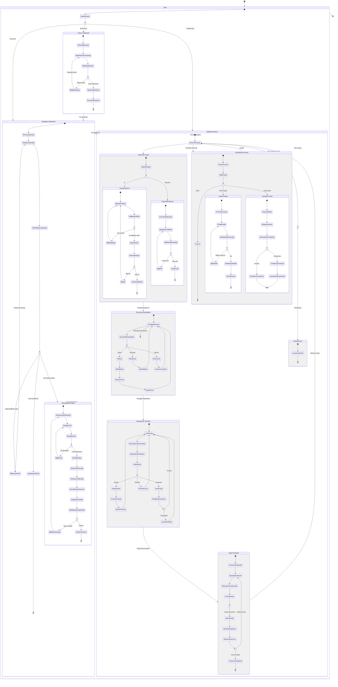

# Diagram Podróży Użytkownika - 10x Cards

```mermaid
stateDiagram-v2
    [*] --> Start
    
    state Start {
        [*] --> WybórŚcieżki
        
        state if_sesja <<choice>>
        WybórŚcieżki --> if_sesja
        if_sesja --> NowyUżytkownik: Brak konta
        if_sesja --> IstniejącyUżytkownik: Ma konto
        if_sesja --> ZalogowanyUżytkownik: Zalogowany
    }
    
    state "Nowy Użytkownik" as NowyUżytkownik {
        [*] --> StronaRejestracji
        StronaRejestracji --> WypełnianieFormularza
        WypełnianieFormularza --> WalidacjaDanych
        
        state if_walidacja <<choice>>
        WalidacjaDanych --> if_walidacja
        if_walidacja --> BłądRejestracji: Błędne dane
        if_walidacja --> RejestracjaSukces: Dane poprawne
        
        BłądRejestracji --> WypełnianieFormularza: Poprawia dane
        RejestracjaSukces --> KomunikatSukcesu
        KomunikatSukcesu --> [*]
    }
    
    state "Istniejący Użytkownik" as IstniejącyUżytkownik {
        [*] --> StronaLogowania
        StronaLogowania --> PodajeCredentials
        PodajeCredentials --> WeryfikacjaLogowania
        
        state if_logowanie <<choice>>
        WeryfikacjaLogowania --> if_logowanie
        if_logowanie --> BłądLogowania: Nieprawidłowe dane
        if_logowanie --> LogowanieSukces: Dane poprawne
        if_logowanie --> ZapomniałemHasła: Klik zapomniałem
        
        BłądLogowania --> PodajeCredentials: Próbuje ponownie
        LogowanieSukces --> [*]
    }
    
    state "Odzyskiwanie Hasła" as ZapomniałemHasła {
        [*] --> StronaForgotPassword
        StronaForgotPassword --> PodajeEmail
        PodajeEmail --> WysyłkaLinku
        
        state if_email <<choice>>
        WysyłkaLinku --> if_email
        if_email --> EmailWysłany: Email poprawny
        if_email --> BłądEmail: Email błędny
        
        BłądEmail --> PodajeEmail
        EmailWysłany --> SprawdzaSkrzynkę
        SprawdzaSkrzynkę --> OtwieraLinkZEmaila
        OtwieraLinkZEmaila --> StronaResetPassword
        
        StronaResetPassword --> PodajeNoweHasło
        PodajeNoweHasło --> WalidacjaNowegoHasła
        
        state if_reset <<choice>>
        WalidacjaNowegoHasła --> if_reset
        if_reset --> BłądResetowania: Token wygasł
        if_reset --> HasłoZmienione: Sukces
        
        BłądResetowania --> StronaForgotPassword
        HasłoZmienione --> [*]
    }
    
    state "Aplikacja Główna" as ZalogowanyUżytkownik {
        [*] --> StronaTworzenia
        
        state "Tworzenie Fiszek" as TworzenieFiszek {
            [*] --> WybórMetody
            
            state if_metoda <<choice>>
            WybórMetody --> if_metoda
            if_metoda --> GenerowanieAI: AI
            if_metoda --> TworzenieRęczne: Ręcznie
            
            state "Generowanie AI" as GenerowanieAI {
                [*] --> WklejanieTekstu
                WklejanieTekstu --> WalidacjaTekstu
                
                state if_długość <<choice>>
                WalidacjaTekstu --> if_długość
                if_długość --> BłądWalidacji: Zły rozmiar
                if_długość --> WywolanieAI: Prawidłowy tekst
                
                BłądWalidacji --> WklejanieTekstu
                WywolanieAI --> StanŁadowania
                
                state if_ai <<choice>>
                StanŁadowania --> if_ai
                if_ai --> BłądAI: Błąd AI
                if_ai --> ListaKandydatów: Sukces
                
                BłądAI --> WklejanieTekstu
                ListaKandydatów --> [*]
            }
            
            state "Tworzenie Ręczne" as TworzenieRęczne {
                [*] --> FormularzManualny
                FormularzManualny --> WypełniaFrontBack
                WypełniaFrontBack --> WalidacjaManualnej
                
                state if_manual <<choice>>
                WalidacjaManualnej --> if_manual
                if_manual --> BłądPól: Puste pola
                if_manual --> ZapisFiszki: Dane OK
                
                BłądPól --> WypełniaFrontBack
                ZapisFiszki --> [*]
            }
        }
        
        state "Recenzja Kandydatów" as RecenzjaKandydatów {
            [*] --> PrzeglądanieListy
            PrzeglądanieListy --> DecyzjaDlaKandydata
            
            state if_akcja <<choice>>
            DecyzjaDlaKandydata --> if_akcja
            if_akcja --> Akceptacja: Akceptuj
            if_akcja --> Edycja: Edytuj
            if_akcja --> Odrzucenie: Odrzuć
            
            Edycja --> ModalEdycji
            ModalEdycji --> ZmianaTreści
            ZmianaTreści --> ZapisZmian
            ZapisZmian --> PrzeglądanieListy
            
            Akceptacja --> ZapisWBazie
            Odrzucenie --> UsuwanieLokalnie
            
            ZapisWBazie --> PrzeglądanieListy
            UsuwanieLokalnie --> PrzeglądanieListy
            
            PrzeglądanieListy --> [*]: Wszystkie przejrzane
        }
        
        state "Zarządzanie Fiszkami" as ZarządzanieFiszkami {
            [*] --> ListaFiszek
            ListaFiszek --> WyszukiwanieFiltrowanie
            WyszukiwanieFiltrowanie --> WyświetlanieWyników
            
            WyświetlanieWyników --> WybórAkcji
            
            state if_zarządzanie <<choice>>
            WybórAkcji --> if_zarządzanie
            if_zarządzanie --> EdytujFiszkę: Edycja
            if_zarządzanie --> UsuńFiszkę: Usuwanie
            if_zarządzanie --> PowrótDoListy: Zamknij
            
            EdytujFiszkę --> FormularzEdycji
            FormularzEdycji --> ZapisanieZmian
            ZapisanieZmian --> ListaFiszek
            
            UsuńFiszkę --> DialogPotwierdzenia
            
            state if_potwierdzenie <<choice>>
            DialogPotwierdzenia --> if_potwierdzenie
            if_potwierdzenie --> UsuwanieZBazy: Potwierdza
            if_potwierdzenie --> ListaFiszek: Anuluje
            
            UsuwanieZBazy --> ListaFiszek
            PowrótDoListy --> ListaFiszek
        }
        
        state "Sesja Powtórek" as SesjaPowtórek {
            [*] --> GenerowanieKolejki
            GenerowanieKolejki --> WyświetlanieFiszki
            WyświetlanieFiszki --> OdpowiedźUżytkownika
            OdpowiedźUżytkownika --> OcenaWiedzy
            
            state if_ocena <<choice>>
            OcenaWiedzy --> if_ocena
            if_ocena --> ZapisWyniku: Oznacza poziom
            
            ZapisWyniku --> AktualizacjaStatusu
            AktualizacjaStatusu --> ObliczanieTerminu
            
            state if_kolejka <<choice>>
            ObliczanieTerminu --> if_kolejka
            if_kolejka --> WyświetlanieFiszki: Kolejna fiszka
            if_kolejka --> PodsumowanieSesji: Koniec kolejki
            
            PodsumowanieSesji --> [*]
        }
        
        state "Zarządzanie Kontem" as ZarządzanieKontem {
            [*] --> StronaAccount
            StronaAccount --> WybórOpcji
            
            state if_account <<choice>>
            WybórOpcji --> if_account
            if_account --> ZmianaHasła: Zmień hasło
            if_account --> UsunieciKonta: Usuń konto
            if_account --> Powrót: Wróć
            
            state "Zmiana Hasła" as ZmianaHasła {
                [*] --> FormularzZmiany
                FormularzZmiany --> PodajeHasła
                PodajeHasła --> WeryfikacjaObecnego
                
                state if_hasło <<choice>>
                WeryfikacjaObecnego --> if_hasło
                if_hasło --> BłądHasła: Błędne obecne
                if_hasło --> AktualizacjaHasła: OK
                
                BłądHasła --> PodajeHasła
                AktualizacjaHasła --> ToastSukcesu
                ToastSukcesu --> [*]
            }
            
            state "Usunięcie Konta" as UsunieciKonta {
                [*] --> PrzyciskDelete
                PrzyciskDelete --> DialogUsunięcia
                DialogUsunięcia --> OstrzeżenieOTrwałości
                
                state if_delete <<choice>>
                OstrzeżenieOTrwałości --> if_delete
                if_delete --> TransakcjaUsunięcia: Potwierdza
                if_delete --> AnulowanieUsunięcia: Anuluje
                
                AnulowanieUsunięcia --> [*]
                TransakcjaUsunięcia --> UsuwanieZBazyDanych
                UsuwanieZBazyDanych --> [*]
            }
            
            Powrót --> [*]
        }
        
        StronaTworzenia --> TworzenieFiszek
        TworzenieFiszek --> RecenzjaKandydatów: Po generowaniu AI
        RecenzjaKandydatów --> ZarządzanieFiszkami: Przegląd zapisanych
        ZarządzanieFiszkami --> SesjaPowtórek: Rozpocznij powtórki
        SesjaPowtórek --> StronaTworzenia: Zakończ sesję
        StronaTworzenia --> ZarządzanieKontem: Wchodzi na konto
        ZarządzanieKontem --> StronaTworzenia: Powrót
        
        state if_wylogowanie <<choice>>
        StronaTworzenia --> if_wylogowanie: Klik Logout
        if_wylogowanie --> WylogowanieUżytkownika: Potwierdza
        
        state "Wylogowanie" as WylogowanieUżytkownika {
            [*] --> UsuwanieŚcieżki
            UsuwanieŚcieżki --> [*]
        }
    }
    
    NowyUżytkownik --> IstniejącyUżytkownik: Po rejestracji
    IstniejącyUżytkownik --> ZalogowanyUżytkownik: Po logowaniu
    ZapomniałemHasła --> IstniejącyUżytkownik: Po zmianie hasła
    ZalogowanyUżytkownik --> Start: Po wylogowaniu
    ZarządzanieKontem --> Start: Po usunięciu konta
    
    Start --> [*]
```
