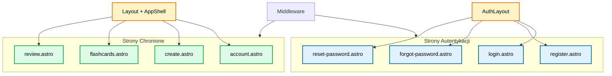
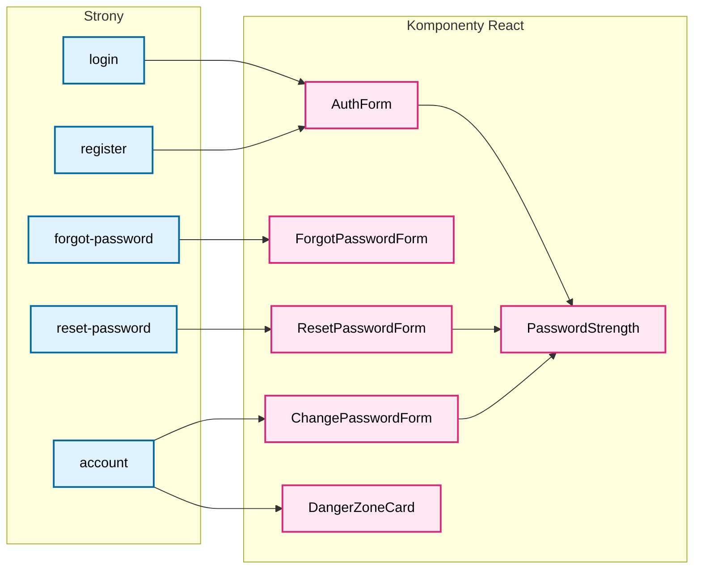
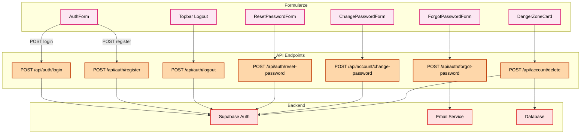
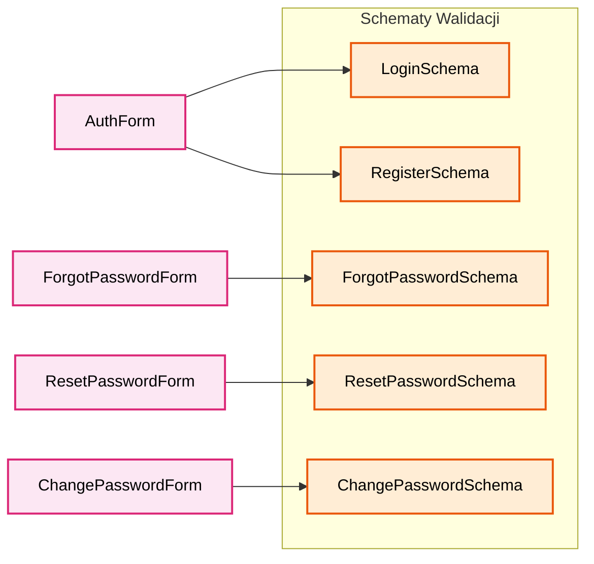

# Diagram Architektury UI - Moduł Autentykacji

## Diagram 1: Struktura Stron i Layouts

## Diagram 2: Komponenty Autentykacji

## Diagram 3: Przepływ API i Backend

## Diagram 4: Walidacja Zod

